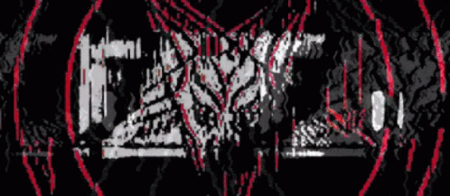

# Hi there 👋  

I'm **Ozora R. D.**  

🔒 Passionate about **Cyber Security** and exploring how systems can be both broken and protected.  
💻 Love to experiment with **frontend development** and turn ideas into functional projects.  
📚 Currently a student at **SMK Raden Umar Said** majoring in **Software Engineering (PPLG)**.

---
### 🔧Langue that i learn

---
## 🚀 What I Do  
- 🕵️‍♂️ Bug hunter with experience finding vulnerabilities in several **government & popular websites**.  
- 🛠️ Build small-to-medium projects from scratch, focusing on both **UI/UX** and **functionality**.  
- 🌐 Tinker with **Linux, networking, and security tools** to sharpen my skills.  

---

## 🧰 Tech Stack  
- **Security Tools**: Wireshark, Nmap  
- **Languages**: HTML, CSS, JavaScript  
- **Other Skills**: Linux basics, network configuration  

---

## 📫 Social Media  

 
 

---

⭐ *Always curious. Always learning. Always building.*  
